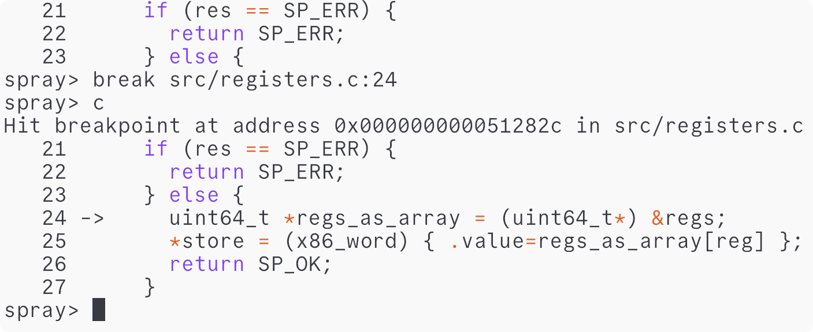

<p align="center">
	<h2 align="center">🐛🐛🐛 Spray 🐛🐛🐛</h3>
 <p align="center">
  <a href="https://github.com/d4ckard/spray/#%EF%B8%8F-installation">Get started</a> -
  <a href="https://github.com/d4ckard/spray/issues">Issues</a> -
  <a href="https://github.com/d4ckard/spray/issues/new">Bug report</a>
 </p>
</p>

 
&nbsp;&nbsp;&nbsp;&nbsp;&nbsp;&nbsp; *Spray debugging itself*

Spray is a debugger targeted at C code that includes a core set of debugging tasks. All functionality is supposed to be as simple as possible and fit comfortably in your head.

This also means that Spray only fulfills a small set of needs. It's inspired by the typical local debugging workflow that I do most of the time.

I started working on Spray out of frustration with the complexity of GDB and a general interest in how debuggers work.

## 🦾 Features

- [x] Breakpoints on functions, on lines in files and on addresses
- [x] Reading and writing memory
- [x] C syntax highlighting
- [x] Backtraces
- [x] Instruction, function and line level stepping

## 🚀 Roadmap 

- [ ] [redis-cli](https://redis.io/docs/ui/cli/)-like command auto-completion to improve command discoverability
- [ ] Interacting with variables (printing, setting, etc.)
- [ ] Backtraces based on DWARF info
- [ ] Command modularity

## 💿️ Installation

Parts of the Spray frontend are written in Scheme and embedded into the application
using [CHICKEN Scheme](https://www.call-cc.org/) which compiles Scheme to C. Currently,
you need to have [CHICKEN installed](https://code.call-cc.org/#download) to build Spray.
In the future it's possible that the generated C files are provided instead so that you
only need a C compiler.

Spray depends on [libdwarf](https://github.com/davea42/libdwarf-code/releases)
so if you want to build Spray, you need to install libdwarf first.
Then, to install Spray you clone this repository and run `make`. Note the you
have to [clone all the submodules](https://stackoverflow.com/a/4438292) too.

```sh
git clone --recurse-submodules https://github.com/d4ckard/spray.git
cd spray
make
```

The compiled binary is named `spray` and can be found in the `build` directory.

To use `spray` as a regular command you need to [add it to your `$PATH`](https://askubuntu.com/a/322773).

## 🏃‍♀️ Running Spray

Ensure that the binary you want to debug has debug information enabled, i.e. it was compiled with the `-g` flag. Also, you should disable all compile-time optimizations to ensure the best output.

The first argument you pass to `spray` is the name of the binary that should be debugged (the debugee). All subsequent arguments are the arguments passed to the debugee.

For example

```sh
spray tests/assets/print-args.bin Hello World
```

starts a debugging session with the executable `print-args.bin`
this executable the additional arguments `Hello` and `World`
(note that you need to run `make` in `tests/assets` to build
`print-args.bin`).

## ⌨️ Commands

### Reading and writing values

| Command      | Argument(s)          | Description                                             |
|--------------|----------------------|---------------------------------------------------------|
| `print`, `p` | `<variable>`         | Print the value of the runtime variable.                |
|              | `<register>`         | Print the value of the register.                        |
|              | `<address>`          | Print the value of the program's memory at the address. |
| `set`, `t`   | `<variable> <value>` | Set the value of the runtime variable.                  |
|              | `<register> <value>` | Set the value of the register.                          |
|              | `<address> <value>`  | Set the value of the program's memory at the address.   |


Currently all values are full 64-bit words.

### Breakpoints

| Command         | Argument(s)     | Description                                   |
|-----------------|-----------------|-----------------------------------------------|
| `break`, `b`    | `<function>`    | Set a breakpoint on the function.             |
|                 | `<file>:<line>` | Set a breakpoint on the line in the file.     |
|                 | `<address>`     | Set a breakpoint on the address.              |
| `delete`, `d`   | `<function>`    | Delete a breakpoint on the function.          |
|                 | `<file>:<line>` | Delete a breakpoint on the line in the file.  |
|                 | `<address>`     | Delete a breakpoint on the address.           |
| `continue`, `c` |                 | Continue execution until the next breakpoint. |

### Stepping

| Command      | Description                                     |
|--------------|-------------------------------------------------|
| `next`, `n`  | Go to the next line. Don't step into functions. |
| `step`, `s`  | Go to the next line. Step into functions.       |
| `leave`, `l` | Step out of the current function.               |
| `inst`, `i`  | Step to the next instruction.                   |

### Notes

- Register names are prefixed with a `%`, akin to the AT&T assembly syntax. This avoids name conflicts between register names and variable names. For example, to read the value of `rax`, use `print %rax`.

- Currently all values are full 64-bit words without any notion of a type. This will change in the future.

- `<address>` always denotes a hexadecimal number.

- `<value>` can be either a hexadecimal or a decimal number. If it's not clear from the literal itself whether a given number is decimal or hexadecimal, `0x` can be used to explicitly prefix hexadecimal numbers.

- The names of all known registers can be found in the `reg_descriptors` table in `src/registers.h`.

- It's possible that the location passed to `break`, `delete`, `print`, or `set` is both a valid function name and a valid hexadecimal address. For example, `add` could refer to a function called `add` and the number `0xadd`. In such a case, the default is to interpret the location as a function name. Use the prefix `0x` to explicitly specify an address.

In addition to the REPL, you can use `spray --help` to see all parameters that are available on the command line.

## 🛠️Contributing

All contributions are welcome. Before opening a pull request, please run
the test suite locally to verify that your changes don't break any other
features.

If any of the tests fail because they are in conflict with the
change you made, make sure to either improve your changes so that they
pass the tests or to change the test in a way that again verifies correct
behavior.

It's possible that some of the tests fail due to off-by-one errors when
making assertions about specific values found in the example binaries that
are used in the tests. Refer to [this issue](https://github.com/d4ckard/spray/issues/2)
for more details. You can ignore tests that fail for this reason only.

